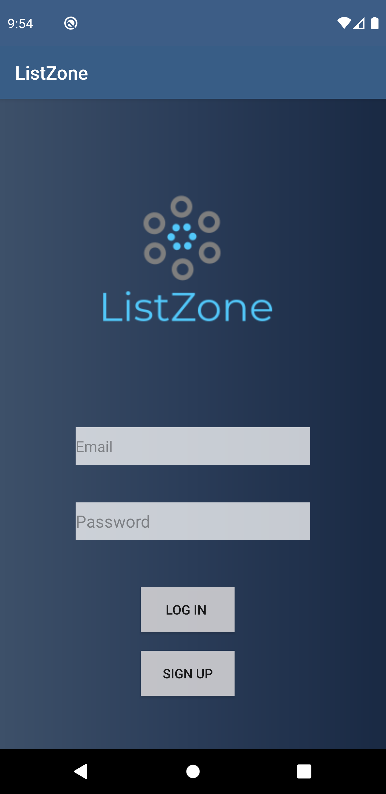
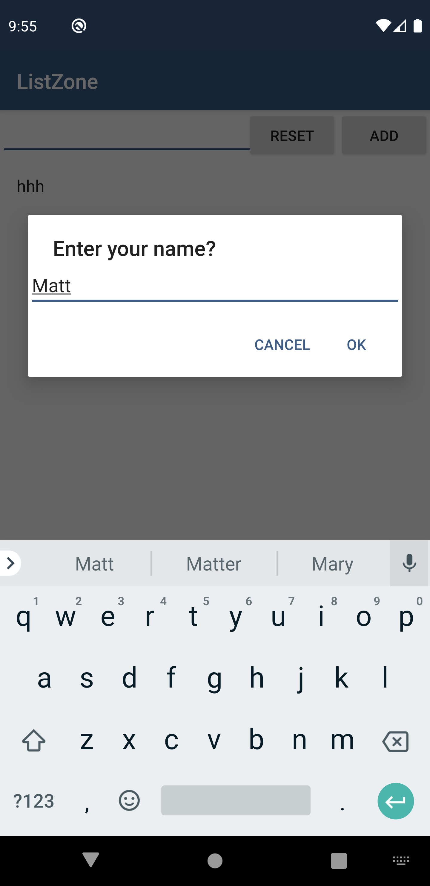
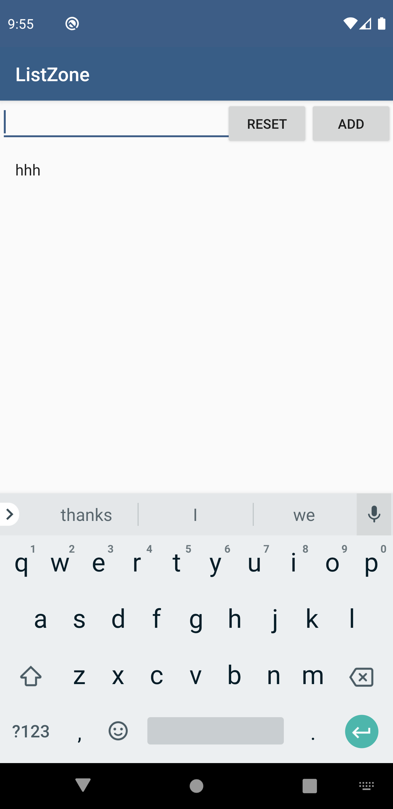
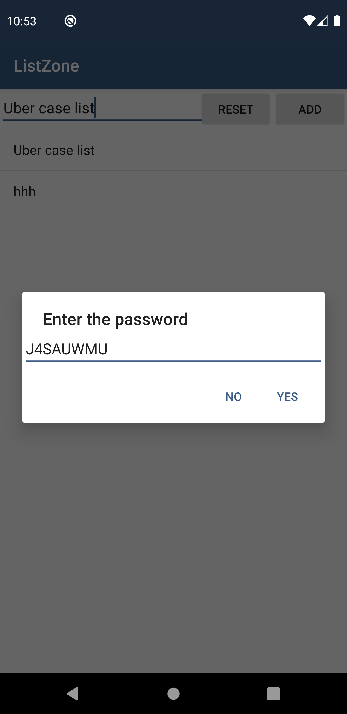
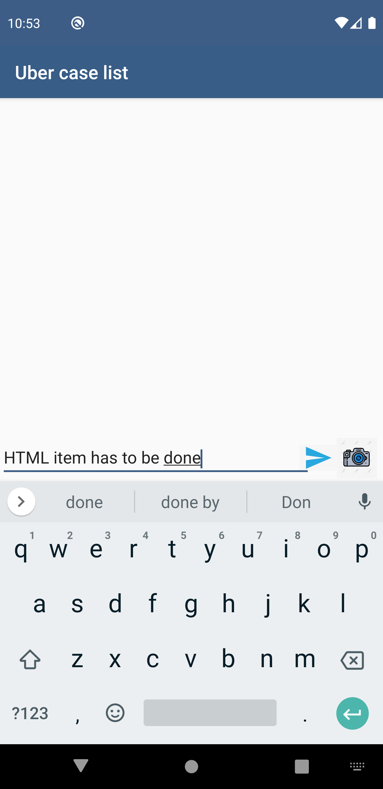
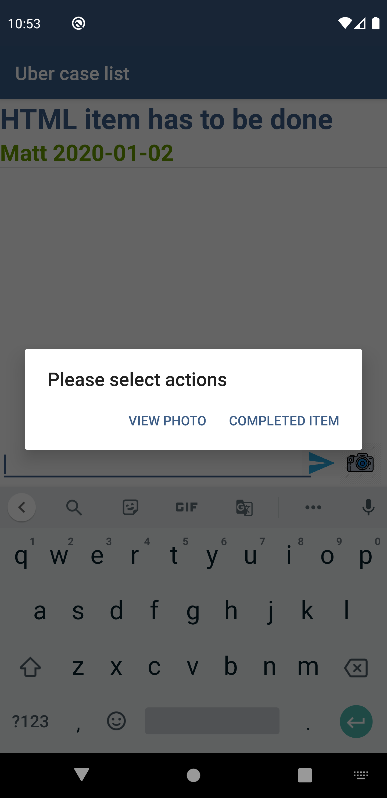

# RealLifeTodolist
A to-do-list witha a list-sharing and easily managaeable features. Implement real-time database from Firebase. Text and Photos are able to upload and retrieve from the database

# Setup

Pixel3 with API 29
Minimal Sdk requirements are below: 
CompileSdkVersion 26
minSdkVersion 15
TargetSdkVersion 26
# Manual 

1.	Install the latest version of Android Studio, make sure Google play plugin is installed and up-to-date. More guidance for Android Studio is available in the following link: https://developer.android.com/studio/intro/?gclid=Cj0KCQjw0brtBRDOARIsANMDykZFwdD-E1KjTOLk9VwtLaTHpxw3Hd8QAia1hlbs-ffVg9IEy3ghyr8aAp9SEALw_wcB

2.	Once the building process finish, please feel free to run it. The installation may last for 30 seconds.

3.	When App is open, you will be on the login page. We strongly suggest you test our application with multiple accounts. You can open two emulators and sign up with two different email addresses. 

4.	After successfully sing up and log in, you need to input a name for each account, this name will be used for to-do items editing. 

5.	Please review chapter 3 ‘How the App works’ to help your application testing. Have fun:)

